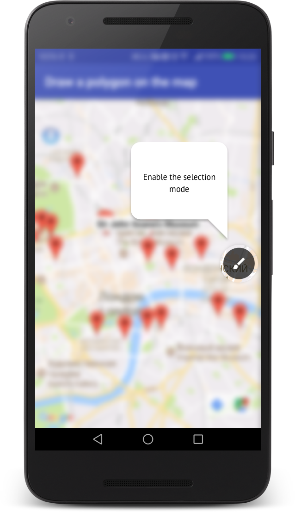
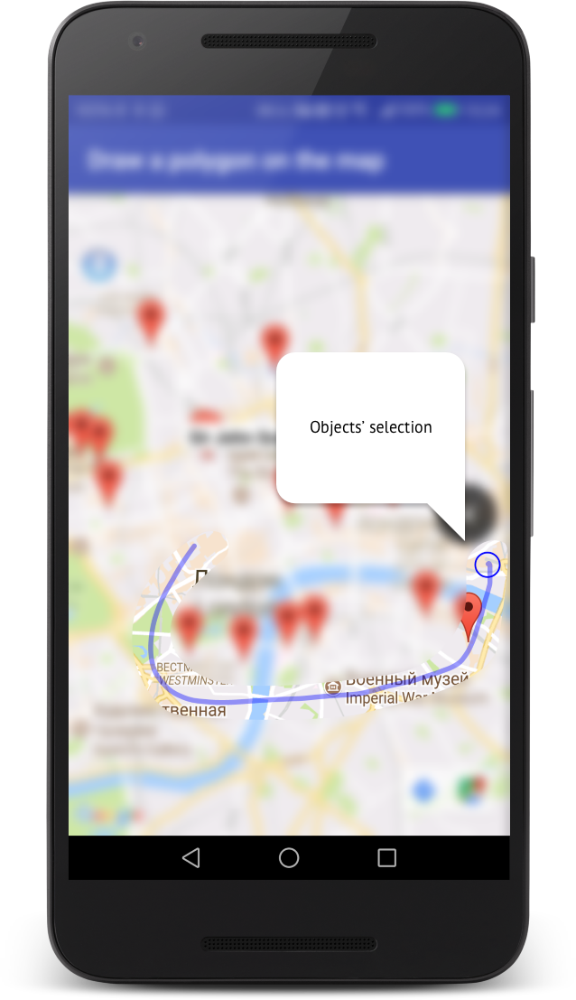
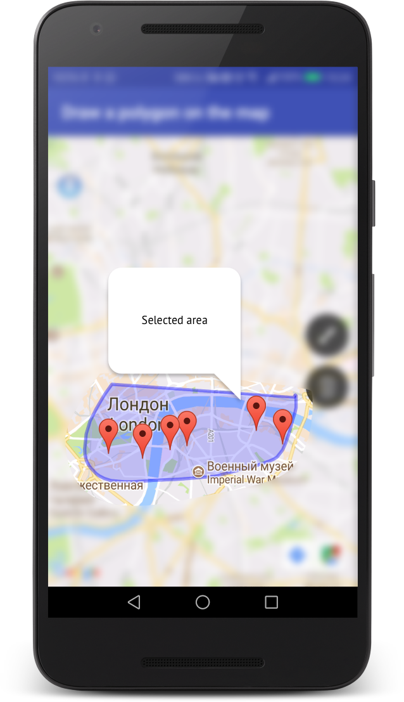

# uZone
This project demonstrates the function of selecting objects, marked in advance on the map with markers. Selecting objects implemented through the drawing a polygon, covering the marks on the map. 

To view this application you can download apk-file from the .
## Instruction
1) To put the selection mode

 

2) Draw out the objects of Your interests. In that case, if the objects will be in the selected region - polygon will not be drawn

3) Close the selection mode

## Note
Depending on the task, you can extend the functionality of the application. For example, to implement a search function, add a new markers to the map, etc. 
Interface elements can also be set. To choose the background color of the polygon, its boundaries etc.